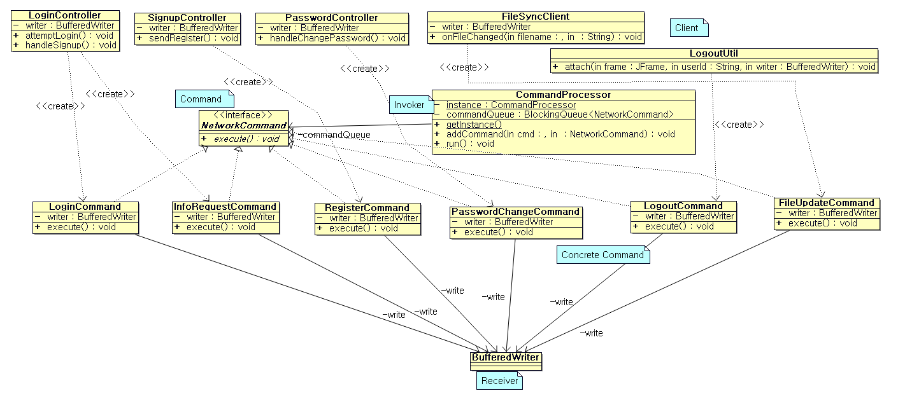
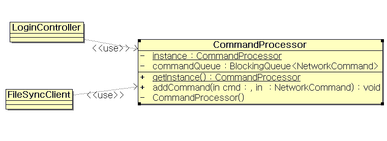
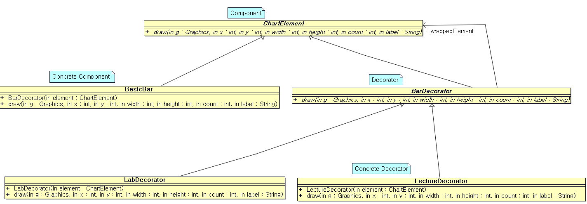
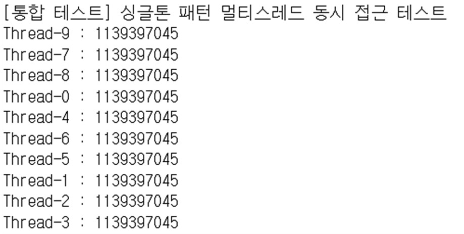

# 🏛️ Design Pattern Project: 강의실 예약 시스템 (Server)

## 📖 Project Overview
이 프로젝트는 기존의 절차지향적으로 작성된 강의실 예약 시스템을 **객체지향 설계 원칙(SOLID)**과 **GOF 디자인 패턴**을 적용하여 리팩토링한 결과물입니다.
Java Socket 통신**을 기반으로 한 C/S(Client-Server) 아키텍처**를 따르며, 본 레포지토리는 비즈니스 로직과 데이터 처리를 담당하는 **Server** 소스 코드를 포함하고 있습니다.

[📄 **프로젝트 결과보고서(전공설계) 보기**](./OOM-3.프로젝트결과보고서(전공설계)-2분반-2조.pdf)

[📄 **실행영상 보기**](https://www.youtube.com/watch?v=4T6IS4JgeU0)
---

## 🔗 Client Repository
사용자 인터페이스(GUI) 및 시각화 로직(Decorator Pattern 등)이 포함된 클라이언트 코드는 아래 링크에서 확인하실 수 있습니다.

👉 **[Design_Patterns_Client 레포지토리 바로가기](https://github.com/myname-jin/Design_Patterns_Client)**

---

##  System Architecture & Applied Patterns
이 프로젝트의 핵심은 **기능 구현을 넘어선 '설계의 유연성'**입니다. 복잡한 분기문(`if-else`)을 제거하고, 객체 간의 결합도를 낮추기 위해 다음과 같은 패턴을 적재적소에 적용했습니다.

### 1. Command Pattern (커맨드 패턴)
> **목적:** 클라이언트의 요청(로그인, 예약, 파일 전송)을 객체로 캡슐화하여 인보커(Invoker)와 리시버(Receiver)를 분리

서버는 클라이언트로부터 들어오는 다양한 요청(String Protocol)을 분석하여 즉시 처리하지 않고, `ConcreteCommand` 객체로 변환하여 `CommandQueue`에 적재합니다. 이를 통해 **비동기 처리**와 **요청 실행 시점의 제어**가 가능해졌습니다.



* **Invoker:** `CommandProcessor` (요청을 큐에 쌓고 순차적으로 실행)
* **Command Interface:** `NetworkCommand` (execute 메서드 정의)
* **Concrete Commands:** `LoginCommand`, `RegisterCommand`, `FileUpdateCommand` 등

### 2. Singleton Pattern (싱글톤 패턴)
> **목적:** 서버의 핵심 자원(소켓 처리기, DB 관리자)에 대한 단일 인스턴스 보장 및 스레드 안전성 확보

다수의 클라이언트 스레드가 동시에 접근하는 `CommandProcessor`를 싱글톤으로 구현하여, **메모리 낭비를 방지**하고 **데이터 경합(Race Condition)을 예방**했습니다.



* **Implementation:** `CommandProcessor` 클래스 내 `private` 생성자와 `getInstance()` 메서드 활용 (Lazy Initialization & Synchronized).

### 3. Decorator Pattern (데코레이터 패턴)
> **목적:** 통계 그래프 시각화 시 강의실/실습실 여부에 따라 색상과 아이콘을 동적으로 추가

**⚠️ Note:** 이 패턴은 통계 데이터를 시각화하는 **Client(GUI)** 측에 구현되어 있습니다. 상세 코드는 클라이언트 레포지토리를 참조해주세요.



* **Base Component:** `BasicBar` (기본 막대 그래프)
* **Decorators:** `LabDecorator` (실습실 스타일), `LectureDecorator` (강의실 스타일)
* 👉 **[클라이언트 코드 보러가기](https://github.com/myname-jin/Design_Patterns_Client)**

---

## 🧪 System Verification (Integration Test)
시스템 핵심 설계의 안정성을 검증하기 위해 통합 테스트를 수행했습니다.

### 🛠️ Singleton Pattern Thread-Safety Test
서버의 핵심 자원인 `CommandProcessor`가 다수의 클라이언트가 동시에 접속하는 멀티스레드 환경에서도 **단일 인스턴스(Unique Instance)**를 유지하는지 검증했습니다.

* **Test Scenario:**
    1. 10개의 스레드를 동시에 생성하여 각자 `CommandProcessor.getInstance()`를 호출.
    2. 각 스레드가 획득한 인스턴스의 **HashCode(메모리 주소)**를 출력.
    3. 모든 스레드 종료 후(`join`), 최종적으로 `Assertions.assertTrue`를 통해 무결성 검증.



<details>
<summary><b>👉 테스트 코드(Test Code) 보기 (Click)</b></summary>

```java
public class IntegrationTestSingletonTest {

    @Test
    public void testMultithreadedAccess() throws InterruptedException {
        System.out.println("[통합 테스트] 싱글톤 패턴 멀티스레드 동시 접근 테스트");

        // 스레드 10개를 동시에 getInstance()를 호출하게 만듦
        Thread[] threads = new Thread[10];

        for (int i = 0; i < 10; i++) {
            threads[i] = new Thread(() -> {
                // 각 스레드가 인스턴스를 요청
                CommandProcessor instance = CommandProcessor.getInstance();

                // 각자 얻은 인스턴스의 주소값(HashCode) 출력
                System.out.println(Thread.currentThread().getName() + " : " + System.identityHashCode(instance));
            });
            threads[i].start();
        }

        // 모든 스레드가 종료되기를 기다립니다. (검증을 위해 필수)
        for (Thread t : threads) {
            t.join(1500);
        }

        // 멀티스레드 환경에서도 실패가 없었는지 확인
        Assertions.assertTrue(true, "테스트가 에러 없이 실행 완료됨.");
    }
}
